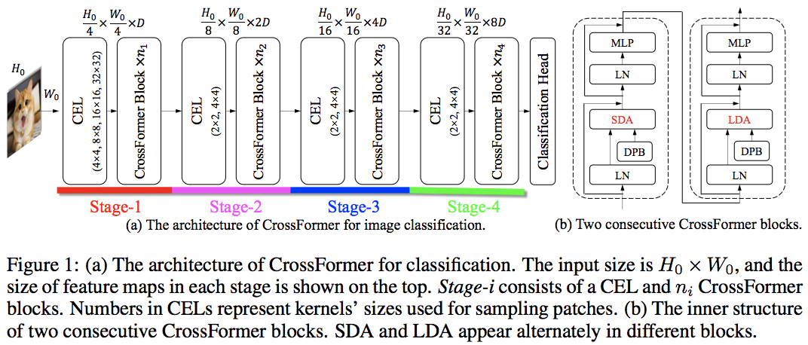
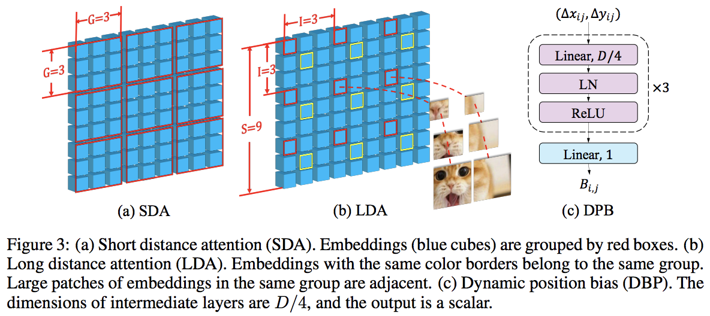

## Crossformer

</img>

</img>

"Transformers have made great progress in dealing with computer vision tasks. However, existing vision transformers do not yet possess the ability of building the interactions among features of different scales, which is perceptually important to visual inputs. The reasons are two-fold: (1) Input embeddings of each layer are equal-scale, so no cross-scale feature can be extracted; (2) to lower the computational cost, some vision transformers merge adjacent embeddings inside the self-attention module, thus sacrificing small-scale (fine-grained) features of the embeddings and also disabling the cross-scale interactions. To this end, we propose Cross-scale Embedding Layer (CEL) and Long Short Distance Attention (LSDA). On the one hand, CEL blends each embedding with multiple patches of different scales, providing the self-attention module itself with cross-scale features. On the other hand, LSDA splits the self-attention module into a short-distance one and a long-distance counterpart, which not only reduces the computational burden but also keeps both small-scale and large-scale features in the embeddings. Through the above two designs, we achieve cross-scale attention. Besides, we put forward a dynamic position bias for vision transformers to make the popular relative position bias apply to variable-sized images. Hinging on the cross-scale attention module, we construct a versatile vision architecture, dubbed CrossFormer, which accommodates variable-sized inputs. Extensive experiments show that CrossFormer outperforms the other vision transformers on image classification, object detection, instance segmentation, and semantic segmentation tasks." - Wenxiao Wang, Lu Yao, Long Chen, Binbin Lin, Deng Cai, Xiaofei He, Wei Liu

## Acknowledgement:
This repository has been created in collaboration with [Dr. Phil 'Lucid' Wang](https://github.com/lucidrains). Please check out his [open-source implementations](https://github.com/lucidrains) of multiple different transformer architectures and [support](https://github.com/sponsors/lucidrains) his work.

### Research Paper:
- https://arxiv.org/abs/2108.00154

### Official Repository
- https://github.com/cheerss/CrossFormer

### Usage:
```python
import numpy as np

key = jax.random.PRNGKey(0)

img = jax.random.normal(key, (1, 224, 224, 3))

v = CrossFormer(
    num_classes = 1000,                # number of output classes
    dim = (64, 128, 256, 512),         # dimension at each stage
    depth = (2, 2, 8, 2),              # depth of transformer at each stage
    global_window_size = (8, 4, 2, 1), # global window sizes at each stage
    local_window_size = 7,             # local window size (can be customized for each stage, but in paper, held constant at 7 for all stages)
)

init_rngs = {'params': jax.random.PRNGKey(1), 
            'dropout': jax.random.PRNGKey(2)}

params = v.init(init_rngs, img)
output = v.apply(params, img, rngs=init_rngs)
print(output.shape)

n_params_flax = sum(
    jax.tree_leaves(jax.tree_map(lambda x: np.prod(x.shape), params))
)
print(f"Number of parameters in Flax model: {n_params_flax}")
```

## Citation:
```bibtex
@article{DBLP:journals/corr/abs-2108-00154,
  author    = {Wenxiao Wang and
               Lu Yao and
               Long Chen and
               Deng Cai and
               Xiaofei He and
               Wei Liu},
  title     = {CrossFormer: {A} Versatile Vision Transformer Based on Cross-scale
               Attention},
  journal   = {CoRR},
  volume    = {abs/2108.00154},
  year      = {2021},
  url       = {https://arxiv.org/abs/2108.00154},
  eprinttype = {arXiv},
  eprint    = {2108.00154},
  timestamp = {Thu, 16 Dec 2021 08:30:12 +0100},
  biburl    = {https://dblp.org/rec/journals/corr/abs-2108-00154.bib},
  bibsource = {dblp computer science bibliography, https://dblp.org}
}
```